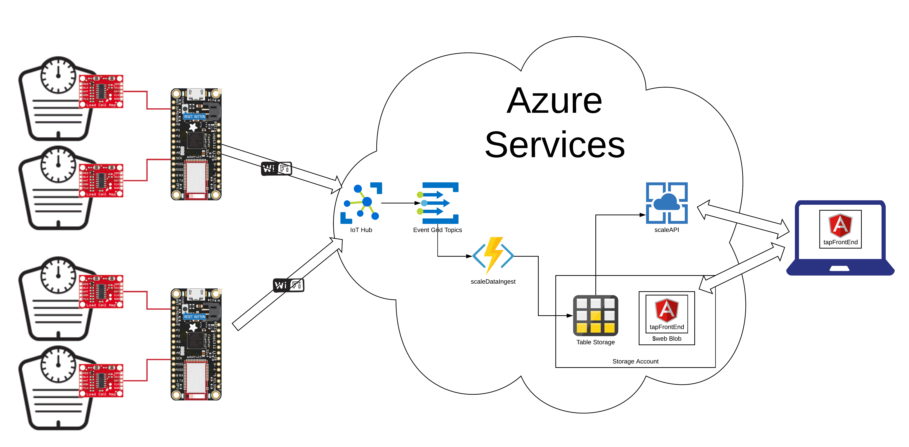

# Keg Scale
This is a project to monitor the amount of beer left in my keggerator by weighing them and providing a web interface to view the data.

### Architecture

##### Scales
Custom scales were created which fit in the keggerator.  In my case they are 9" x 9.75".  The scales are made from a 1/2" thick sheet of HDPP plastic [cutting boards](https://www.amazon.com/gp/product/B01LXE0MBM/ref=oh_aui_search_detailpage?ie=UTF8&psc=1).  [50kg load cells](https://www.amazon.com/gp/product/B071ZYYJHJ/ref=oh_aui_search_detailpage?ie=UTF8&psc=1) are placed in each corner.  The load cells are held in place using a custom [3D printed clip](hw/).

##### Scale Wiring
Sparkfun has a great [tutorial](https://learn.sparkfun.com/tutorials/load-cell-amplifier-hx711-breakout-hookup-guide?_ga=2.146147319.292295071.1545164052-27740493.1545164052) on wiring and using load cells.  I used their [Load Cell Combinator](https://www.sparkfun.com/products/13878) and [Qwiic Scale - NAU7802 board](https://www.sparkfun.com/products/15242) to wire up the scales for prototyping.  Eventually I will use a custom PCB for the scales' interface.

##### Reading Data
Currently data is read and sent to the cloud by a $10 [ESP8266 Huzzah](https://www.adafruit.com/product/2471).

##### Backend
I've included a [shell script](azure/provision.sh) which can be used to automaticlly provision all of the backend services needed on Azure from a Mac or Linux (possibly Windows too if there's a bash shell available).

##### Sending Data
The [Azure IOT SDK](https://github.com/Azure/azure-iot-sdk-c) is used to send data directly from the Arduino to the Azure backend.  Data is stored in Azure Table service which is the cheapest solution I could find.

##### Accessing Data
An Angular frontend app presents the data to the user.

### Organization
Each Arduino can handle up to 8 scales (using 4 NAU7802 devices).  Multiple Arduinos can be used and presented under a single web interface.
